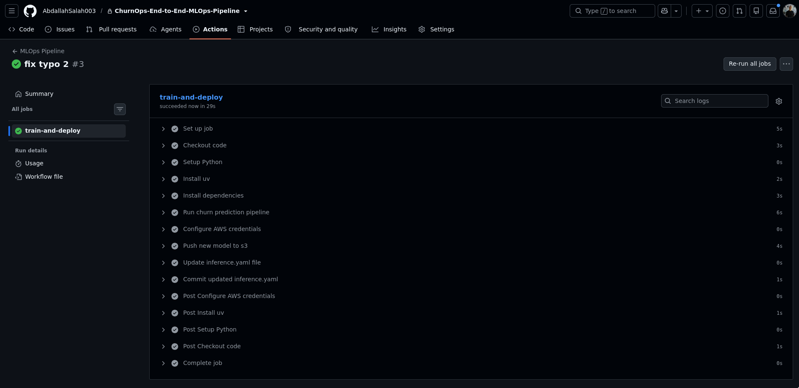

# Churn Model MLOps Pipeline

A simple demonstration of MLOps practices for a customer churn prediction model

## What Does This Model Do?

**Real-World Example:**

Imagine you run a telecom company with thousands of customers. Some customers are happy and stay for years, while others leave (churn) after a few months. This model predicts which customers are likely to leave

**Example Customer:**
- **Sarah** is 45 years old
- Been a customer for 24 months
- Pays $79.99/month
- Total spent: $1,920
- Called customer support 3 times this month

**Model Prediction:**
```json
{
  "churn": 1,
  "churn_probability": 0.73
}
```


## MLOps Pipeline Steps

### 1. Initial Setup

```bash
uv sync

uv run python pipeline.py

# Test API locally
python api.py
```

### 2. DVC Setup 

```bash
dvc init

dvc remote add -d myremote s3://my-bucket/churn-model

dvc add models/churn_model.pkl

dvc push

git add models/churn_model.pkl.dvc .dvc/ .gitignore
git commit -m "Track model with DVC"
```

### 3. Push Model to S3

After training the model and setting up DVC:

```bash
export AWS_ACCESS_KEY_ID=your-key
export AWS_SECRET_ACCESS_KEY=your-secret
export AWS_DEFAULT_REGION=us-east-1
export AWS_ACCOUNT_ID=<YOUR_ID>
export BUCKET_NAME=churn-data-bucket-$AWS_ACCOUNT_ID

aws s3 mb s3://$BUCKET_NAME

dvc push

aws s3 ls s3://$BUCKET_NAME/churn-model/models/ --recursive
```

The model will be stored in S3 at: `s3://$BUCKET_NAME/churn-model/models/model.joblib`


### 5. Kubernetes with KIND

```bash
kind create cluster --name churn-model
```

### 6. Kserve setup

```bash
kubectl apply -f https://github.com/cert-manager/cert-manager/releases/latest/download/cert-manager.yaml


kubectl create namespace kserve


helm install kserve-crd oci://ghcr.io/kserve/charts/kserve-crd \
  --version v0.20.0 \
  --namespace kserve \
  --create-namespace
  
  

helm install kserve-resources oci://ghcr.io/kserve/charts/kserve-resources \
  --version v0.20.0 \
  --namespace kserve \
  --set kserve.controller.deploymentMode=Standard \
  --wait
  
helm install kserve-runtime-configs oci://ghcr.io/kserve/charts/kserve-runtime-configs \
  --version v0.20.0 \
  --namespace kserve \
  --set kserve.servingruntime.enabled=true


# Create a serviceaccount so that the inference service could access the private s3 bucket


kubectl create ns ml

kubectl apply -f serviceaccount.yaml


kubectl apply -f inference.yaml


kubectl get pods -n ml -w


kubectl port-forward svc/churn-predictor-predictor 8080:80 --address 0.0.0.0 -n ml

```

### 7. Test Kserve Inference

```bash
curl -X POST http://localhost:8080/v1/models/churn-predictor:predict \
  -H "Content-Type: application/json" \
  -d '{
    "instances": [
      [features]
    ]
  }'
```

Expected response:
```json
{
  "predictions": [1]
}
```


### 8. GitHub Actions



### 9. ArgoCD (GitOps)

```bash
kubectl create namespace argocd
kubectl apply -n argocd -f https://raw.githubusercontent.com/argoproj/argo-cd/stable/manifests/install.yaml

kubectl apply -f argocd/application.yaml

kubectl port-forward svc/argocd-server -n argocd 8080:443

# get admin password
kubectl -n argocd get secret argocd-initial-admin-secret -o jsonpath="{.data.password}" | base64 -d
```

## Complete MLOps Workflow

1. **Developer pushes code** → GitHub
2. **GitHub Actions triggered:**
   - Trains model
   - Pushes model to S3 (DVC)
   - Builds Docker image
   - Pushes to ECR
   - Updates `inference.yaml`
3. **ArgoCD detects change** in `inference.yaml`
4. **ArgoCD syncs** → Deploys to Kubernetes
5. **KServe serves** the new model version
